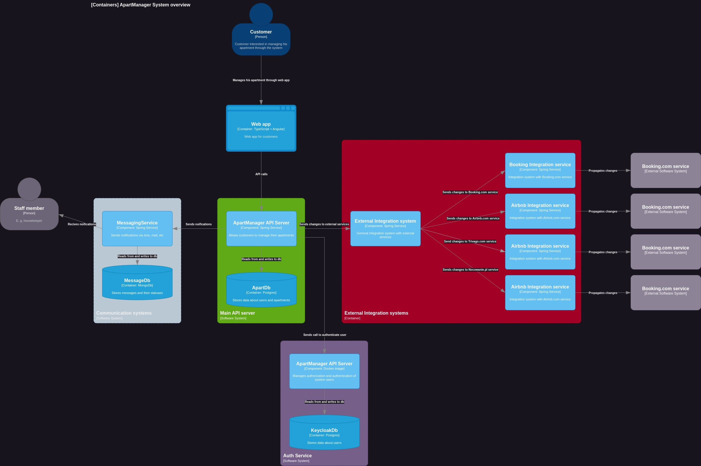

# ADR 2: Architekutra mikroserwisowa

Data: 2023-09-20

## Status
Zaakceptowano

## Kontekst
Potrzebujemy wybrać architekturę dla naszego systemu, aby móć przejść do implementacji.

## Decyzja
Zespół zdecydował skorzystać z architektury mikroserwisowej, ponieważ wyróżnione zostały komponenty z odrębnymi 
funkcjonalnościami. Zdecydowano, że system będzię dzielił się na:
- aplikację webową, która będzie komunikowała się z użytkownikiem za pomocą interfejsu graficzengo,
- serwis, który będzie przetwarzał żądania użytkownika,
- serwis wysyłający wiadomości mailowe i tekstowe,
- serwis, który będzie propagował zmiany do zewnętrznych systemów.

 

## Konsekwencje
System zostanie zaimplementowany w architekturze mikroserwisowej, zgodnie z powyższym diagramem.