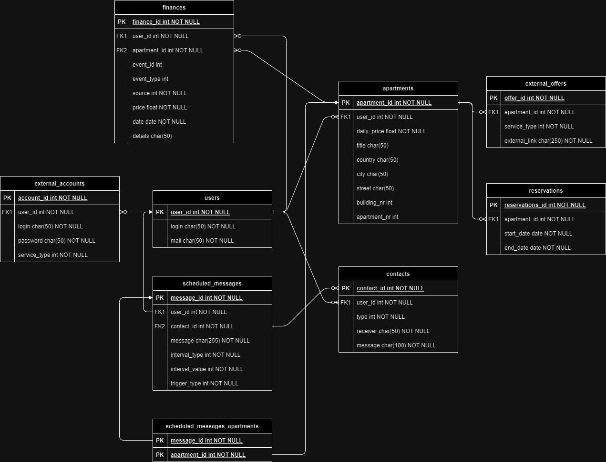

# ADR 5: Baza danych PostgreSQL dla ApartManager API Server

Data: 2023-09-20

## Status
Zaakceptowano

## Kontekst
Potrzebujemy wybrać bazę danych, w której przechowywane będą informację dotyczące użytkowników, apartamentów oraz rezerwacji.

## Decyzja
Zespół zdecydował skorzystać z bazy SQL, a dokładnie PostgreSQL. Wyróżniono następujące encję:
- users,
- apartments,
- reservations,
- external_accounts,
- contacts,
- external_offers,
- finances.

[//]: # (//TODO edytować diagram i dodać finanse)

 

## Konsekwencje
ApartManager API Server będzie wykorzystywać bazę PostgreSQL, której schemat będzie zgodny z powyższym diagramem.